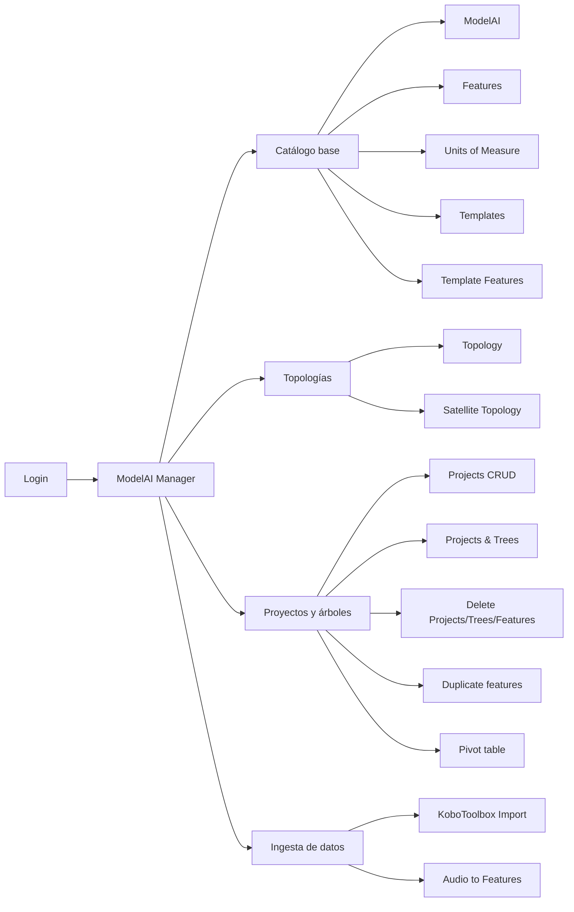

# Funcionalidades — Oráculo Manager (ModelAI Manager)

## Resumen ejecutivo

**Oráculo Manager** (también referida en la interfaz como *ModelAI Manager*) es una aplicación web para administrar el ciclo de vida de datos de campo forestales y ambientales. Permite configurar catálogos maestros (features, unidades, plantillas, modelos de IA), organizar proyectos y árboles con sus mediciones, importar respuestas desde **KoboToolbox**, procesar audios de levantamiento con **Google Gemini** para extraer variables automáticamente, gestionar **topologías geográficas** (predios, parcelas) y **topologías satelitales** (satélites y bandas), y consultar o exportar la información en tablas pivotadas.

La aplicación está construida con React y se conecta a un backend en **AWS Amplify** (autenticación, base de datos GraphQL y almacenamiento de archivos).

---

## Acceso y seguridad

### Inicio de sesión

- Al abrir la aplicación sin sesión activa, el usuario es redirigido a la pantalla de **Login** (`/login`).
- Las credenciales se validan mediante **Amazon Cognito** (integrado con AWS Amplify).
- Tras autenticarse correctamente, el usuario accede al panel principal; la ruta por defecto es **ModelAI** (`/modelai`).

### Rutas protegidas

- Todas las pantallas de gestión requieren usuario autenticado.
- Si la sesión expira o el usuario cierra sesión, debe volver a iniciar sesión para continuar.

### Cierre de sesión

- En la parte inferior del menú lateral aparece el usuario conectado (nombre y correo).
- El botón **Sign Out** cierra la sesión y devuelve al usuario a la pantalla de login.

---

## Navegación general

El menú lateral agrupa las funcionalidades en cuatro bloques conceptuales:

| Bloque | Módulos del menú |
|--------|------------------|
| **Catálogo base** | ModelAI, Features, Units of Measure, Templates, Template Features |
| **Topologías** | Topology, Satellite topology |
| **Proyectos y árboles** | Projects (CRUD), Projects & Trees, Delete Projects/Trees/Features, Duplicate features, Pivot table |
| **Ingesta y procesamiento** | KoboToolbox Import, Audio to Features |



---

## Funcionalidades por módulo

Cada sección sigue el mismo esquema: **para qué sirve**, **pantallas disponibles**, **acciones del usuario** y **casos de uso típicos**.

---

### 1. ModelAI

#### Para qué sirve

Registro y gobierno de **modelos de inteligencia artificial** usados en el ecosistema TerraSacha/Oráculo: versiones, aprobación, costos de tokens, documentación y enlaces a APIs. Permite jerarquías padre/hijo entre modelos y asociación con topologías satelitales.

#### Pantallas

| Pantalla | Ruta |
|----------|------|
| Listado | `/modelai` |
| Crear | `/modelai/create` |
| Detalle | `/modelai/:id` |
| Editar | `/modelai/:id/edit` |

#### Acciones disponibles

- **Listar** todos los modelos con búsqueda por nombre, descripción, versión o grupo.
- **Crear** un modelo con: grupo, nombre, descripción, enlaces a documentación y API, versión, indicadores de última versión (`is_latest`) y aprobación (`is_approved`), costos de tokens, modelo padre opcional y asociación a topología satelital (padre e hijos).
- **Ver detalle** de un registro existente.
- **Editar** cualquier campo del modelo.
- **Eliminar** con confirmación en ventana modal.

#### Casos de uso típicos

- Publicar una nueva versión de un modelo y marcarla como la más reciente.
- Aprobar un modelo antes de usarlo en producción.
- Organizar modelos en familias (modelo padre → versiones hijas).
- Vincular un modelo de IA a un satélite o banda específica del catálogo satelital.

---

### 2. Features

#### Para qué sirve

Define el **catálogo de variables o atributos** que se pueden medir en el campo (por ejemplo: DAP, altura total, observaciones, audio de levantamiento). Cada feature puede tener tipo, grupo, valor por defecto y unidad de medida.

#### Pantallas

| Pantalla | Ruta |
|----------|------|
| Listado | `/features` |
| Crear | `/features/create` |
| Detalle | `/features/:id` |
| Editar | `/features/:id/edit` |

#### Acciones disponibles

- **Listar**, **buscar**, **crear**, **ver**, **editar** y **eliminar** features.
- Asociar una **unidad de medida** al crear o editar.
- Configurar si el valor es numérico decimal (`is_float`).

#### Casos de uso típicos

- Crear el feature `Audio Levantamiento` para almacenar la URL del audio en S3.
- Definir features numéricos (`dbh`, `total_height`) antes de importar datos desde KoboToolbox.
- Estandarizar nombres de variables entre proyectos.

---

### 3. Units of Measure

#### Para qué sirve

Catálogo de **unidades de medida** (metros, centímetros, grados, etc.) referenciadas por los features.

#### Pantallas

| Pantalla | Ruta |
|----------|------|
| Listado | `/unitsofmeasure` |
| Crear | `/unitsofmeasure/create` |
| Detalle | `/unitsofmeasure/:id` |
| Editar | `/unitsofmeasure/:id/edit` |

#### Acciones disponibles

- CRUD completo: listar, buscar, crear, ver detalle, editar y eliminar unidades.
- Campos principales: nombre y abreviatura.

#### Casos de uso típicos

- Registrar `m`, `cm`, `ha` antes de asignarlos a features de inventario forestal.

---

### 4. Templates

#### Para qué sirve

Las **plantillas** agrupan conceptualmente un tipo de levantamiento o formulario (por ejemplo, “Levantamiento Info Parcelas”). No contienen los features directamente; esa relación se define en *Template Features*.

#### Pantallas

| Pantalla | Ruta |
|----------|------|
| Listado | `/templates` |
| Crear | `/templates/create` |
| Detalle | `/templates/:id` |
| Editar | `/templates/:id/edit` |

#### Acciones disponibles

- CRUD completo de plantillas.
- Listado con búsqueda y navegación a detalle/edición.

#### Casos de uso típicos

- Crear la plantilla que usará el procesamiento de audios con Gemini.
- Asociar árboles importados desde Kobo a una plantilla concreta.

---

### 5. Template Features

#### Para qué sirve

Establece la relación **plantilla ↔ feature**: qué variables forman parte de cada template. Es la lista de “palabras clave” que Gemini buscará en un audio o que se esperan en un formulario.

#### Pantallas

| Pantalla | Ruta |
|----------|------|
| Listado | `/templatefeatures` |
| Crear | `/templatefeatures/create` |
| Detalle | `/templatefeatures/:id` |
| Editar | `/templatefeatures/:id/edit` |

#### Acciones disponibles

- CRUD de asociaciones entre un template y un feature.
- Consultar qué features pertenecen a cada plantilla.

#### Casos de uso típicos

- Vincular `plot_number`, `tree_number`, `dbh`, `total_height` a la plantilla de levantamiento de parcelas.
- Preparar el catálogo antes de ejecutar **Audio to Features**.

---

### 6. Topology

#### Para qué sirve

Gestiona la **jerarquía geográfica** de un proyecto: predios, parcelas u otros niveles espaciales, cada uno con polígono (GeoJSON) dibujable en mapa, códigos y estado. Permite asociar árboles a topologías y explorar la jerarquía con los árboles que pertenecen a cada nivel.

#### Pantallas

| Pantalla | Ruta |
|----------|------|
| Listado | `/topologies` |
| Crear | `/topologies/create` |
| Detalle | `/topologies/:id` |
| Editar | `/topologies/:id/edit` |
| Asignar árbol ↔ topología | `/topologies/assign-tree-topology` |
| Jerarquía de árboles | `/topologies/trees-hierarchy` |

#### Acciones disponibles

- **CRUD** de topologías con: proyecto asociado, nombre, códigos alfanuméricos, estado, topología padre y **polígono** editable en mapa (Leaflet).
- **Assign Tree Topology**: seleccionar proyecto, filtrar árboles por columna/valor, elegir uno o varios árboles y asignarlos a una o varias topologías del mismo proyecto.
- **Trees Hierarchy**: elegir proyecto, navegar por la jerarquía de topologías (drill-down desde la raíz) y ver los árboles vinculados a cada nodo, con búsqueda y breadcrumb de ruta.

#### Casos de uso típicos

- Dibujar el polígono de un predio y crear parcelas hijas dentro de él.
- Relacionar árboles de inventario con la parcela donde fueron medidos.
- Explorar cuántos árboles hay bajo cada nodo de la topología.

---

### 7. Satellite topology

#### Para qué sirve

Catálogo jerárquico de **satélites y bandas espectrales** (tipos `SATELLITE` y `BAND`), independiente de la topología geográfica de campo. Sirve de referencia para asociar modelos de IA a fuentes de datos satelitales.

#### Pantallas

| Pantalla | Ruta |
|----------|------|
| Listado | `/satellite-topology` |
| Crear | `/satellite-topology/create` |
| Detalle | `/satellite-topology/:id` |
| Editar | `/satellite-topology/:id/edit` |
| Jerarquía | `/satellite-topology/hierarchy` |

#### Acciones disponibles

- CRUD de nodos satelitales con tipo, nombre, descripción y padre opcional.
- **Hierarchy**: exploración por niveles con búsqueda, breadcrumb y vista de hijos del nodo seleccionado.

#### Casos de uso típicos

- Registrar un satélite (por ejemplo, Sentinel-2) y sus bandas como nodos hijos.
- Consultar la estructura completa antes de vincular un ModelAI.

---

### 8. Projects (CRUD)

#### Para qué sirve

Administración directa de **proyectos** como entidad maestra (nombre y estado), sin entrar al detalle de árboles o features.

#### Pantallas

| Pantalla | Ruta |
|----------|------|
| Listado | `/projects-admin` |
| Crear | `/projects-admin/create` |
| Detalle | `/projects-admin/:id` |
| Editar | `/projects-admin/:id/edit` |

#### Acciones disponibles

- Listar, buscar, crear, ver, editar y eliminar proyectos.
- Campos principales: **nombre** y **estado** (por ejemplo, `active`).

#### Casos de uso típicos

- Crear el proyecto “Levantamiento Info Parcelas” antes de importar desde KoboToolbox.
- Desactivar un proyecto que ya no recibe datos.

---

### 9. Projects & Trees

#### Para qué sirve

Vista de **exploración jerárquica** de todos los proyectos con sus árboles, features y valores (RawData). Es la pantalla principal para auditar datos importados o generados por procesamiento de audio.

#### Pantallas

| Pantalla | Ruta |
|----------|------|
| Vista jerárquica | `/projects` |

#### Acciones disponibles

- Expandir/colapsar: **Proyecto → Árbol → Feature → RawData**.
- Carga automática de árboles con paginación interna (100 por página).
- Reproducir **archivos de audio** almacenados en S3 cuando el valor del feature es una URL de audio.
- Reintentar carga si hay error de red o permisos.

#### Casos de uso típicos

- Verificar que una importación desde Kobo creó los árboles y valores esperados.
- Escuchar un audio de levantamiento asociado a un árbol.
- Revisar conteos de árboles con audios procesados vs. pendientes (información agregada por proyecto).

---

### 10. Delete Projects/Trees/Features

#### Para qué sirve

Herramienta de **limpieza y depuración** para eliminar proyectos, árboles, features o registros RawData de forma controlada, con confirmación.

#### Pantallas

| Pantalla | Ruta |
|----------|------|
| Eliminación masiva | `/projects/delete` |

#### Acciones disponibles

- Navegar por la misma jerarquía Proyecto → Árbol → Feature → RawData.
- Seleccionar entidades y **eliminar** con modal de confirmación.
- Carga paginada de grandes volúmenes de datos.

#### Casos de uso típicos

- Borrar un proyecto de prueba y todo su contenido.
- Eliminar RawData erróneos antes de reimportar.
- Depurar features huérfanos tras una migración.

> **Precaución:** las eliminaciones son permanentes. Usar solo con permisos adecuados y respaldo previo si aplica.

---

### 11. Duplicate features

#### Para qué sirve

Detecta **árboles que tienen el mismo feature con más de un valor (RawData)** —datos duplicados— y permite eliminar los registros sobrantes dejando uno solo por feature.

#### Pantallas

| Pantalla | Ruta |
|----------|------|
| Detección y limpieza | `/projects/duplicates` |

#### Acciones disponibles

- Listar árboles con features duplicados (indica cuántos RawData hay y cuántos se eliminarían).
- Seleccionar uno o varios árboles.
- **Eliminar duplicados** en lote, con barra de progreso por árbol/feature.

#### Casos de uso típicos

- Corregir importaciones dobles desde KoboToolbox.
- Limpiar después de reprocesar audios que generaron RawData repetidos.

---

### 12. Pivot table

#### Para qué sirve

Genera una **tabla pivotada** de inventario: cada fila es un árbol, las columnas son los features, y una columna pivote agrupa o identifica los registros según el feature elegido (por ejemplo, número de parcela o código de árbol).

#### Pantallas

| Pantalla | Ruta |
|----------|------|
| Tabla pivotada | `/projects/pivot` |

#### Acciones disponibles

- Seleccionar **proyecto**.
- Seleccionar **feature pivote** (columna que define la fila o clave principal).
- Paginar resultados (tamaño de página configurable).
- Filtrar filas.
- **Exportar a CSV** con un clic.
- Reproducir audios S3 desde celdas que contienen URLs de audio.

#### Casos de uso típicos

- Exportar el inventario completo de un proyecto para análisis en Excel o BI.
- Revisar en formato tabular todos los atributos de cada árbol.
- Compartir un CSV con el equipo de monitoreo o verificación.

---

### 13. KoboToolbox Import

#### Para qué sirve

**Importa respuestas de formularios** alojados en KoboToolbox y las transforma en proyectos, árboles, features y RawData dentro de Oráculo. Sube automáticamente los archivos de audio al almacenamiento S3 de Amplify.

#### Pantallas

| Pantalla | Ruta |
|----------|------|
| Importación | `/kobotoolbox/import` |

#### Acciones disponibles

- Configurar conexión:
  - **URL del servidor** (por ejemplo, `kf.kobotoolbox.org`)
  - **API Key**
  - **Project UID** del formulario en Kobo
  - **Formato** de descarga: JSON o CSV
  - **Máximo de filas** (opcional)
- Iniciar importación y seguir el **progreso** por etapas: obtención de datos, análisis, procesamiento, subida de audios.
- Ver **resumen** al finalizar: árboles creados, features creados/omitidos, RawData creados, audios subidos, filas omitidas por duplicado, advertencias.

#### Comportamiento funcional (resumen)

1. Descarga los datos del proyecto Kobo indicado.
2. Por cada columna del formulario, crea un **feature** si no existe.
3. Por cada fila, crea un **árbol** y asocia valores como **RawData**.
4. Las columnas de audio se suben a **S3** y el feature queda con la URL del archivo.
5. Reutiliza proyectos y features existentes si ya están en el sistema.

#### Casos de uso típicos

- Cargar el proyecto “Levantamiento Info Parcelas” desde KoboToolbox.
- Incorporar nuevas respuestas de campo sin captura manual en la app.
- Poblar la base antes de ejecutar **Audio to Features** o la **Pivot table**.

---

### 14. Audio to Features

#### Para qué sirve

Procesa los **audios de levantamiento** guardados en los árboles (feature tipo audio, por ejemplo `Audio Levantamiento` o `audio_levantamiento`) usando **Google Gemini**: transcribe y extrae los valores definidos en un **Template**, creando o actualizando **RawData** por cada feature detectado.

#### Pantallas

| Pantalla | Ruta |
|----------|------|
| Procesamiento de audios | `/audio-to-features` |

#### Acciones disponibles

- Seleccionar **plantilla (Template)** cuyos features se buscarán en el audio.
- Ingresar **API Key de Gemini**.
- Elegir árboles a procesar:
  - **Todos** los árboles cargados, o
  - **Selección manual** de árboles concretos.
- Filtrar árboles:
  - Solo **no procesados** (`are_audios_processed` ≠ true).
  - Por **feature** y **valor** del feature.
- Ajustar **límite de árboles** a cargar (paginación).
- Ver listado de árboles con **cantidad de audios** detectados por árbol.
- **Reproducir** cada audio desde S3 antes de procesar.
- Iniciar procesamiento y seguir **progreso por árbol** (en cola, procesando, completado, error).
- Tras procesar, el sistema marca el árbol con **`are_audios_processed = true`**.
- Consultar lista de árboles ya procesados con su audio de levantamiento.

#### Casos de uso típicos

- Extraer DAP, altura y observaciones desde grabaciones de campo sin digitación manual.
- Reprocesar solo árboles pendientes después de una importación masiva.
- Validar audios escuchándolos en la misma pantalla antes de lanzar el lote.

---

## Flujos típicos de extremo a extremo

### Flujo 1: Ingesta desde KoboToolbox

1. **Units of Measure** — registrar unidades necesarias.
2. **Features** — crear o verificar variables del formulario.
3. **Templates** + **Template Features** — definir la plantilla del levantamiento.
4. **Projects (CRUD)** — crear el proyecto si no existe.
5. **KoboToolbox Import** — importar respuestas (URL, API key, UID del proyecto Kobo).
6. **Projects & Trees** — revisar jerarquía y valores importados.
7. *(Opcional)* **Pivot table** — exportar CSV para análisis externo.

### Flujo 2: Procesamiento de audios con IA

1. Completar el **Flujo 1** o asegurar que los árboles tengan URLs de audio en S3.
2. **Templates** + **Template Features** — confirmar la lista de variables a extraer.
3. **Audio to Features** — elegir plantilla, API key de Gemini, filtrar no procesados y ejecutar.
4. **Projects & Trees** o **Pivot table** — validar los RawData generados.
5. **Pivot table** — exportar CSV con el inventario actualizado.

### Flujo 3: Mantenimiento y calidad de datos

1. **Duplicate features** — detectar y eliminar RawData duplicados.
2. **Delete Projects/Trees/Features** — depurar registros o proyectos obsoletos.
3. **Projects & Trees** — verificación final.

### Flujo 4: Organización geográfica

1. **Projects (CRUD)** — crear o seleccionar el proyecto.
2. **Topology** — crear predio/parcela con polígonos y jerarquía padre-hijo.
3. **Assign Tree Topology** — vincular árboles del proyecto a las topologías.
4. **Trees Hierarchy** — explorar la estructura y los árboles por nodo.

### Flujo 5: Publicación de modelos de IA

1. **Satellite topology** — registrar satélite y bandas.
2. **ModelAI** — crear modelo, versionar, aprobar y asociar a topología satelital.
3. Consultar en listado filtrando por grupo, versión o estado de aprobación.

---

## Stack y entorno (referencia breve)

| Capa | Tecnología |
|------|------------|
| Interfaz | React 18, TypeScript, Vite |
| Estilos y UI | Tailwind CSS, Headless UI, Heroicons |
| Navegación | React Router |
| Mapas | Leaflet, react-leaflet |
| Backend | AWS Amplify: Cognito (auth), AppSync GraphQL (datos), S3 (audios), Lambda (importación Kobo y procesamiento de audio) |

### Comandos de desarrollo

```bash
npm install    # instalar dependencias
npm run dev    # servidor local (por defecto http://localhost:3000)
npm run build  # compilación de producción
```

Para más detalles de instalación, consultar [README.md](../README.md) en la raíz del repositorio.

---

## Glosario

| Término | Descripción |
|---------|-------------|
| **Project** | Contenedor de alto nivel que agrupa árboles y topologías de un estudio o levantamiento. |
| **Tree** | Registro de un árbol o punto de inventario dentro de un proyecto; puede tener plantilla asociada y flag de audios procesados. |
| **Feature** | Variable o atributo medible (numérico, texto, audio, etc.) definido en el catálogo maestro. |
| **RawData** | Valor concreto de un feature para un árbol (texto, número, URL de audio, fechas). |
| **Template** | Plantilla que agrupa un conjunto de features para un tipo de levantamiento o procesamiento. |
| **Template Feature** | Asociación entre un template y un feature (define qué se extrae o se espera). |
| **Topology** | Nodo de jerarquía geográfica (predio, parcela, etc.) con polígono y relación padre-hijo, ligado a un proyecto. |
| **Satellite Topology** | Nodo de jerarquía de satélite o banda espectral (`SATELLITE` / `BAND`). |
| **Audio Levantamiento** | Feature que almacena la URL del audio de campo en S3; insumo del módulo Audio to Features. |
| **are_audios_processed** | Indicador en el árbol: `true` cuando sus audios ya fueron procesados por Gemini. |
| **ModelAI** | Registro de un modelo de IA con versión, aprobación, costos y vínculos a documentación, API y topología satelital. |
| **Pivot table** | Vista tabular que muestra todos los features de los árboles de un proyecto, con columna pivote y exportación CSV. |

---

## Documentos relacionados

En la raíz del repositorio existen guías técnicas adicionales, por ejemplo:

- `AUTHENTICATION_SETUP.md` — configuración de autenticación.
- `VERIFY_AUDIO_TO_FEATURES.md` — verificación del flujo de audios.
- `TROUBLESHOOTING_KOBOTOOLBOX_PROXY.md` — resolución de problemas con KoboToolbox.

Este documento se centra en **qué puede hacer el usuario** en la aplicación; no sustituye las guías de despliegue ni de desarrollo del backend.
